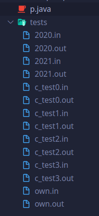
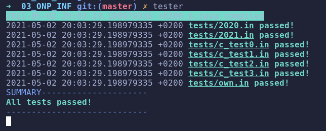
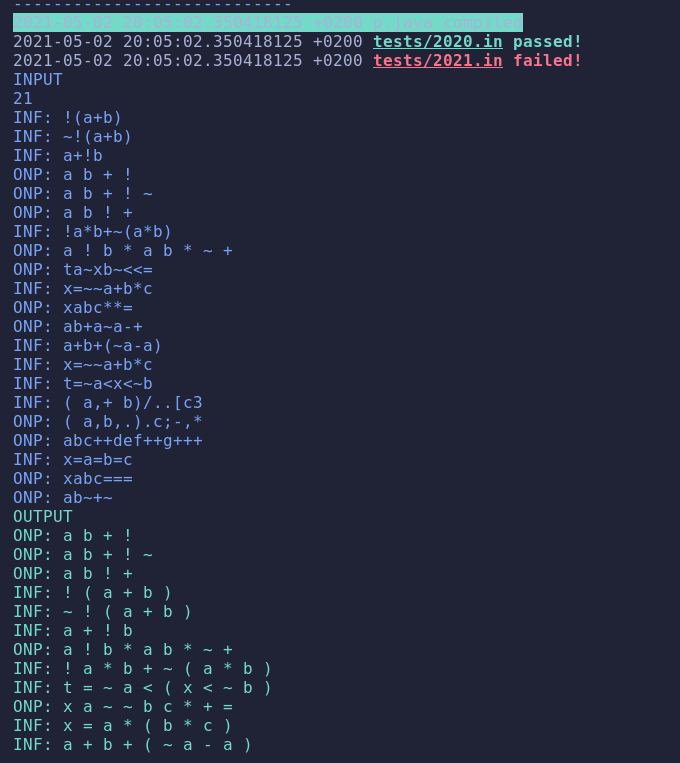
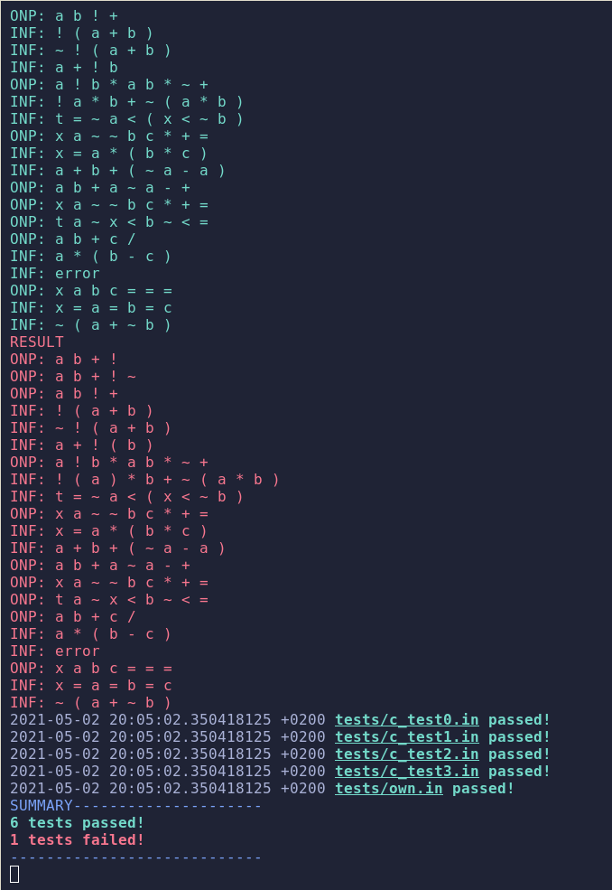

# Tester do aplikacji konsolowych w javie. Na potrzeby zajęć na UJ.

## Użycie

Plik `tester` dodaj do PATH.

W folderze z programem:

- kod źródłowy musi mieć nazwę `p.java`
- skrypt jest uruchamiany na każdym zapisie pliku
- testy brane są z folderu `tests`
- rozszerzenia plików:
- - `.in` - input
- - `.out` - output
- - nazwa pliku dowolna, tak długo jak nazwa inputu i outputu są takie same i mają odpowiednie rozszezenia
- - pliki z kropkami w nazwie - nietestowane

## Wyniki

